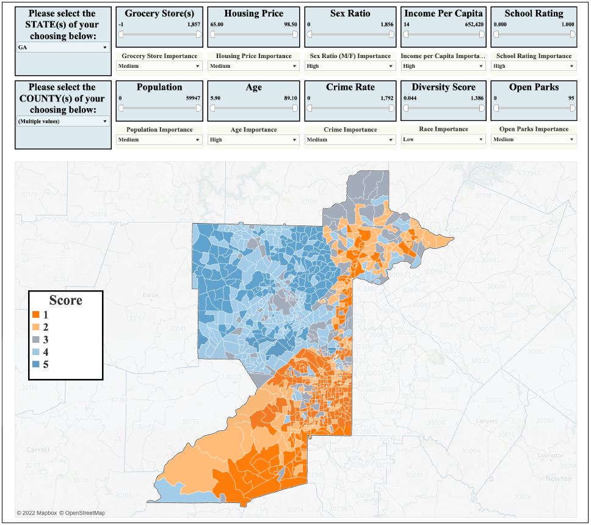

# A Recommendation Tool for Real-Estate Neighborhood Search
## Introduction

Relocating to a new city or investing in real estate involves numerous factors that significantly influence decision-making. Current commercial tools like Zillow, Realtor, Trulia, and Apartments.com primarily focus on available inventory and property-specific attributes, offering a limited view of the broader context. 

Our recommendation tool aims to bridge this gap by providing a comprehensive analysis of neighborhoods based on personal preferences and essential decision attributes. By integrating various data sources and leveraging advanced analytics, our tool will help users assess factors such as safety, schools, amenities, commute times, and community demographics. This holistic approach will enable individuals and investors to make more informed and rational choices when selecting a neighborhood in an unfamiliar location. The potential impact of this project extends to anyone seeking a new place to live, investing in real estate, or conducting research in these areas, offering a valuable resource for making well-rounded and confident decisions.

## Interactive Dashboard
Below images shows the interactive dashboard of the tool.  The tool allow user to select the state and county.  It offers various attributes, here user can select upper and lower ranges from the available ranges shown on slider. Based on the user inputs the tool calculates the score for all the neighborhoods and represents the areas with color gradient as shown below. Here, 1 represents the high score and 5  represents lowest score.

## Environment
For this project, used SQLite for database storage and Tableu for creating the interactive dashboard.
## Dataset
For this project we used the datasets from different sources. The combined dataset is utilized for final analysis. Below are the different sources used :
1. Census
2. FBI
3. opnIPSR

## Contact
Contact me at poonamsdongare04@gmail.com to access the complete paper and more information.
Visit neighborhoodsearch.net to use the interactive dashboard.
